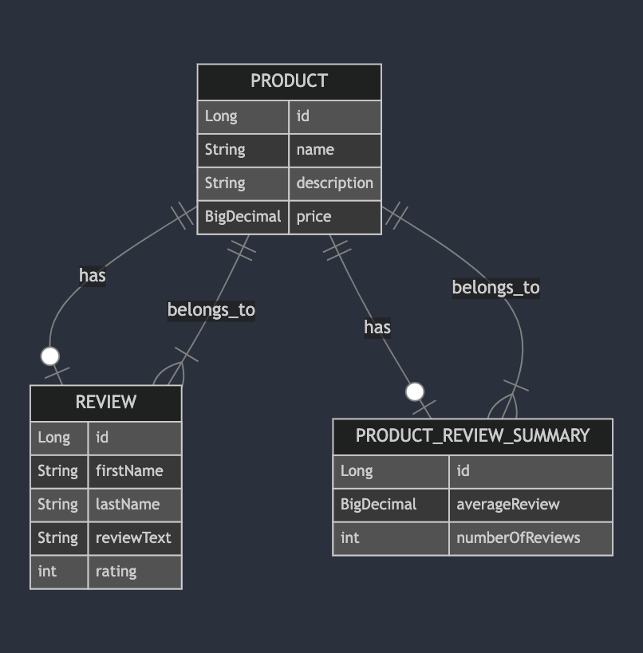

# Project Title

## Overview
This project address requirements sent from cloudtalk for the interview.
Project uses 
- PostgreSql for data storage
- Redis for caching
- Kafka for queues used for asynchronous average score calculation
- java @Async for asynchronous service notification


## Architecture
### High-Level Overview

In general Products and Reviews follow following design

Controller(Restful endpoint) -> Service(business logic) -> Repository (db access) uses ORM Model -> database

In addition redis(cache) and kafka(message broker) are used.

### Architecture in detail

#### Product

- Get API

In this diagram we can see sequence of calls all the way from client to database and use of cache.


#### Reviews

Reviews are a bit more complex. 

When fetching reviews for a product we use same caching mechanism as products.

For create/update/delete, we need to invalidate cache, notify service and recalculate average rating. 

For recalculation of average rating we send message to kafka queue. This message is picked up by consumer and recalculates the rating. 

Update review as example


- Kafka Consumer


#### Database Schema




#### Caching

I use Redis for caching with these two keys

**reviews:{product_id}** - used for caching reviews for a product

**reviews_summary:{product_id}** - used for caching average rating 

General mechanism how cache is used can be seen on this diagram:


##### Products

Product use caching in these use cases
- when fetching reviews for a product -> all reviews for a product are cached
- when fetching average score (ProductReviewSummary) 

##### Reviews

Reviews use caching in this use case

- when fetching reviews for a product

We don't use caching for individual reviews. This is a possibility for enhancement.

When a review is updated, created or deleted

- cache of reviews for a product is invalidated.

- cache for average score is invalidated


#### Average score calculation

For average score calculation I use following mechanism

For each review create/update/delete 
--> sent message to kafka, with info (productId, old_rating, new_rating)

--> in transaction

-- pull existing score from db for a product

-- calculate new score

-- store new score in db for a product

Message details:

**productId** - product id

**old_rating** - represents rating before update or delete, for new review, this value is null

**new rating** - represents rating after update or create, for delete operation, this value is null

In the database for average score we store these fields

- product_id

- average_rating

- number_of_ratings

Formula for calculating new average rating when review is created:

[(db_average_rating * db_number_of_ratings) + new_rating] / (db_number_of_ratings + 1)

When review is deleted

[(db_average_rating * db_number_of_ratings) - old_rating] / (db_number_of_ratings - 1)

When review is updated:

[(db_average_rating * db_number_of_ratings) - old_rating + new_rating] / (db_number_of_ratings)


** Pros

- quick calculation of the new score, we use only numerical operation to devise score

- in case of concurrent updates, we get error and messages gets enqueued and score can be recalculated later

- in case of repeated errors, we get a message in dead letter queue and it can be requeued later.

** Cons

- kafka can deliver same message twice, which means, we can same review twice for calculation. 

- We would have to ensure consistency by reading all reviews and calculate score. By reading all reviews we have a different problem with increasing number of reviews and we would have to design good schema for querying and aggregating data

- enqueuing of messages happen within transaction. Which means if there's a db failure, we would recalculate average score, while data in db are inconsistent. We would have to do some aspect or decorator pattern to make sure transaction completes successfully before sending it to the queue. 


#### Service notification

I use fairly simple @Async mechanism. This means I can call a code which would call a different service without causing current thread to take  performance hit or even failure.

** Pros

- Simple mechanism
- Current thread is not affected


** Cons

- currently service notification happen within transaction. Which means if there's a db failure, we would notify service, while data in db are inconsistent.
- We would have to do some aspect or decorator pattern to make sure transaction completes successfully before notifying the service.

### Components
   
2. **Backend**

   - Java Spring Boot
   
   - Docker


3. **Infrastructure**

   - Kafka:  message queuing, used in average rating recalculation
   
   - PostgreSQL: data storage
   
   - Redis: caching

### Key Design Decisions
- **Java vs Golang vs Node.js** I'm mostly familiar with Java ecosystem, but project could be rewritten to to node.js or golang, 
- **PosgresSQL vs. NoSQL VS other DB**: PostgresSQL was chosen because of easy set up with docker and familiarity.
  other data sources could be used here 
- **Redis vs. Ehcache vs. other**: Redis is well known library which could be also used with other languages, Redis integrates well with java, so it was  chosen.
- **Kafka vs Redis Pub/Sub**: Kafka is a common message broker that can integrate well other languages. Redis Pub/Sub provides easy set up, but managing failures (dead letter queues) is better with Kafka. 
- **Async notification vs Queue system or Redis Pub/Sub ** Asynchronous notification was chosen to show case how to send message asynchronously so it doesn't affect running thread

### Pros/Cons of Key Decisions

- **Java**:
   - Pros: Good knowledge of java. Showcase infrastructure and general approach well. 
   - Cons: Not Golang/Node.js, which will make my chances lower
   
   
- **PostgresSQL**:
   - Pros: Well known db. Easy set up, simple and suitable for the project. 
   - Cons: Maybe nosql would be better storage for average score calculation, but that's just a speculation.
  
   
- **Redis**   
   - Pros: Standard solution for caching 
   - Cons: I don't cache everything at the moment. Individual reviews are not cached, which can be easily added.
  
   
- **Kafka**
   - Pros: Native support for dead letter queues, for concurrency handling. Code is simpler when dealing with retries comparing to Redis Pub/Sub solution. 
   - Cons:  Extra component in the infrastructure. We need to deal with multiple messages. Current solution doesn't do it and goes for simplicity.

   
- **Async notification**
   - Pros: Simple. Doesn't block running thread for expensive calls. 
   - Cons:  Not big control over failures and retries in case of failures, possibly a queue system would be better when dealing with errors and robustness.   


### Prerequisites
- Docker
- Java 
- maven


### Running Locally

#### 1. **Clone the Repository**

```bash
git clone https://github.com/chudikm/cloud_talk_assignment.git
cd cloud_talk_assignment
```

#### 2. **Build**
- Build the backend with Maven:

```bash
./mvnw clean package
```

- Run the backend locally using Docker:

```bash
docker-compose up --build
```

- To able to run code locally against "real" services, you can set them up on docker instance

postgreSQL

```
docker run --name postgres -e POSTGRES_DB=cloudtalk_db -e POSTGRES_USER=cloudtalk -e POSTGRES_PASSWORD=password -p 5432:5432 -d postgres 
```

Redis

```
docker run --name redis -p 6379:6379 -d redis
```

Kafka + Zookeeper

```
docker run -d --name zookeeper \ -p 2181:2181 \ -e ZOOKEEPER_CLIENT_PORT=2181 \ confluentinc/cp-zookeeper:latest

docker run -d --name kafka \ --link zookeeper \ -p 9092:9092 \ -e KAFKA_BROKER_ID=1 \ -e KAFKA_ZOOKEEPER_CONNECT=zookeeper:2181 \ -e KAFKA_ADVERTISED_LISTENERS=PLAINTEXT://localhost:9092 \ -e KAFKA_OFFSETS_TOPIC_REPLICATION_FACTOR=1 \ confluentinc/cp-kafka:latest
```

Then you can run application locally

```
./mvnw spring-boot:run
```

### Docker Setup
To run the entire application with Docker Compose:


```bash
docker-compose up --build
```

This will bring up the backend and database in containers, along with any necessary services (e.g., Redis, Kafka, postgreSQL).

### Running Tests
- **Unit Tests**: 

```bash
./mvnw test
```

### Manual Testing with cURL
Use the following `cURL` commands to test various API endpoints manually.

#### Product

1. **Create Product** :

```bash
curl -X POST http://localhost:8080/api/products \
     -H "Content-Type: application/json" \
     -d '{"name": "Laptop", "description": "Gaming Laptop", "price": 1499.99}'
```

2. **Get All Products**:

```bash
curl -X GET http://localhost:8080/api/products
```

3. **Get Products by ID**:

```bash
curl -X GET http://localhost:8080/api/products/1
```

4. **Update Product**:

```bash
curl -X PUT http://localhost:8080/api/products/1 \
     -H "Content-Type: application/json" \
     -d '{"name": "Laptop", "description": "High-end Gaming Laptop", "price": 1799.99}'
```

5. **Delete Product**:

```bash
curl -X DELETE http://localhost:8080/api/products/1
```

#### Reviews


1. **Create Review** :

```bash
curl -X POST http://localhost:8080/api/products/1/reviews \
     -H "Content-Type: application/json" \
     -d '{
           "firstName": "John",
           "lastName": "Doe",
           "reviewText": "Amazing product, highly recommend!",
           "rating": 5
         }'
```

2. **Get All Reviews for product**:

```bash
curl -X GET http://localhost:8080/api/products/1/reviews
```

3. **Get Review by ID**:

```bash
curl -X GET http://localhost:8080/api/products/1/reviews/1
```

4. **Update Review**:

```bash
curl -X PUT http://localhost:8080/api/products/1/reviews/10 \
     -H "Content-Type: application/json" \
     -d '{
           "firstName": "Jane",
           "lastName": "Smith",
           "reviewText": "Updated review: still a great product!",
           "rating": 4
         }'
```

5. **Delete Review**:

```bash
curl -X DELETE http://localhost:8080/api/products/1/reviews/1
```

      

## Conclusion
- Project address all the requirements listed in the document sent by cloudtalk
- There is a list of improvements but basic concepts are presents

-- we send review for average score recalculation in the transaction, even we don't know transaction is completed

-- we send notification to a service in the transaction, even we don't know transaction is completed

-- Kafka guarantees at least one delivery, which means same message can be delivered to multiple listeners causing wrong calculation

-- We don't cache individual Reviews, just all reviews per product


